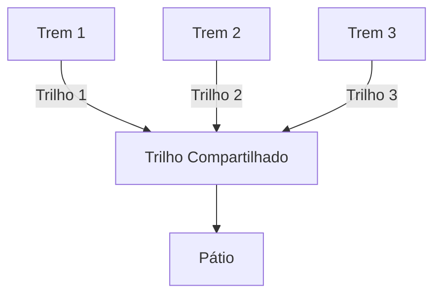

# **Projeto de Sistemas em Tempo Real**

> **Disciplina**: Sistemas em Tempo Real

> **Alunos**:
> - Artênio José Teofilo Correia
> - Edileudo da Silva Guedes Filho
> - José Vanilson de Brito Júnior

## **Descrição**

> **Linguagem usada**: Python

### **> Visão Geral**

Levando-se em consideração o tema "concorrência e sincronização em sistemas operacionais", a ideia do projeto é a implementação de um sistema de controle de tráfego ferroviário, onde os trens concorrem pela passagem por uma convergência nos trilhos. São múltiplos trens vindos de minas operando em três linhas que convergem para um trilho compartilhado, a zona crítica do sistema, chegando no pátio para descarregar.

### **> Funcionamento do código**

As características do sistema são as seguintes:
- Buffer limitado em 2 trens no pátio de manobras;
- Há um semáforo com espaço único funcionando como um Mutex;
- Há um semáforo com espaço duplo para controlar a capacidade do pátio;

As funções no código desempenham os seguintes papéis:
- `print_status`: organiza as saídas de mensagens do código;
- `trem_produtor`: thread que representa os trens das linhas 1, 2 e 3;
- `agente_descarregador`: thread que remove os itens do pátio (operação assíncrona);

No ambiente principal do código, são criadas três threads para os trens do sistema e adicionadas a uma lista chamada "trens". Em seguida, é criada a thread de esvaziamento do buffer. Finalmente, os processos são iniciados. 

Os trens criados se comportam da seguinte maneira (`trem_produtor`):

1. Cada trem criado demora um tempo para carregar na mina;
2. Após carregar, o trem pede acesso ao recurso compartilhado (trilho único) usando a função `.acquire()`;
3. O tempo de travessia pelo trilho único é mantido fixo em $3.2\mathrm{s}$;
4. O trem então tenta descarregar no pátio. Caso o pátio estiver cheio, ocorre o *deadlock*;
5. O buffer é atualizado, incrementando 1;
6. O trilho único é liberado pela função `.release()`.

No descarregamento (`agente_descarregador`), o seguinte acontece:

1. Variável auxiliar `total_no_patio` conta a quantidade de trens no pátio de descarregamento;
2. De forma assíncrona, a função remove trens do pátio e avisa em mensagem.

#### **> Semáforos**

- `vagas_patio` atua como um semáforo que conta as vagas disponíveis por trens no pátio. Começando em 2 (definido pela variável `CAPACIDADE_PATIO`), decresce por uma unidade a cada trem que chega no pátio para realizar o descarregamento;
- `trilho_compatilhado` determina se o trilho compartilhado está livre (1) ou não (0);

#### **> Fluxo de threads**

|Sequência|Thread|Função|
|---|---            |---|
|1|Carregamento     |Espera um tempo aleatório, simulando carregamento do trem na mina.|
|2|Acesso ao trilho |Execução de `trilho_compartilhado.acquire()`. Caso o trilho estiver livre, o trem prossegue, caso contrário ele espera.|
|3|Travessia        |Passagem do trem pelo trilho compartilhado, o que demora um tempo fixo de $3.2\mathrm{s}$.|
|4|Entrada no pátio |Esse é o ponto crítico, onde um *deadlock* pode ocorrer. O trem terminou de atravessar o trilho compartilhado e está entrando no pátio.|
|5|Descarregamento  |Se houver vaga no pátio, o trem entra, caso contrário ele espera. Quando no pátio, o trem descarrega e libera sua vaga chamando `trilho_compartilhado.release()`|

No diagrama a seguir, o funcionamento sequencial do sistema toma forma de blocos. Os três trens trafegam por seus trilhos individuais até que convergem a um trilho compartilhado antes de chegar ao pátio de descarregamento. O controle acontece quando um trem entra no trilho compartilhado, bloqueando acesso aos demais trens, e quando dois estão no pátio ocupando todo o espaço disponível.

#### **> Deadlock**

Um deadlock trata de um impasse na execução onde o sistema trava e não consegue se recuperar. No sistema desenvolvido neste projeto, o deadlock acontece quando o pátio está cheio e um terceiro trem decide entrar no trilho compartilhado. Quando a travessia é concluída, o trem não consegue acessar o pátio e permanece no trilho compartilhado, bloqueando-o.

## **Objetivos**

- Coordenar o acesso exclusivo ao trilho único;
- Garantir a sinalização correta;
  - Prevenir colisões;
  - Prevenir bloqueios;
- Prevenir violações de segurança;